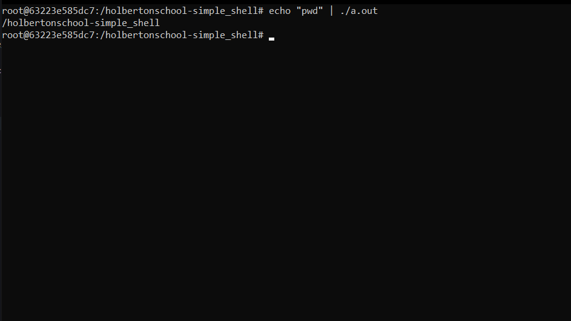

<div id="top"></div>

<!-- PROJECT LOGO -->
<br />
<div align="center">
  <a href="https://github.com/SchneiderSix/holbertonschool-simple_shell">
    
  </a>

<h3 align="center">Simple Shell</h3>

  <p align="center">
    Recreate a Simple Shell in C
    <br />
    <a href="https://github.com/SchneiderSix/holbertonschool-simple_shell"><strong>Explore the docs »</strong></a>
    <br />
    <br />
  </p>
</div>


<!-- TABLE OF CONTENTS -->
<details>
  <summary>Table of Contents</summary>
  <ol>
    <li>
      <a href="#about-the-project">About The Project</a>
    </li>
    <li>
      <a href="#getting-started">Getting Started</a>
    </li>
    <li><a href="#usage">Usage</a></li>
    <li><a href="#examples">Examples</a></li>
    <li><a href="#flowchart">Flowchart</a></li>
    <li><a href="#contact">Contact</a></li>
  </ol>
</details>


<!-- ABOUT THE PROJECT -->
## About The Project

This is a mandatory project for Holberton School made by Juan Matias Rossi from cohort 18. This project is about recreate or build a command intepreter similar to linux shell. This recreation can only take one command per usage and can't process special characters: ``", ', `, \, *, &, #``.

<p align="right">(<a href="#top">back to top</a>)</p>


<!-- GETTING STARTED -->
## Getting Started

Simple shell is a interpreter command-line between kernel and the user mode for it can use the resources of the Operative System. This recreation tokenize the input given into strings, checks the permission of the paths/files and executes the command. This requieres at least Ubuntu 14.04 LTS and gcc 4.8.4. 
<p align="middle"><b>Clone the repository</b>

``` javascript
git clone https://github.com/SchneiderSix/holbertonschool-simple_shell.git
```
<p align="middle"><b>Use these flags if you want to compile</b>

``` javascript
gcc -Wall -Werror -Wextra -pedantic -std=gnu89
```
<p align="middle"><b>Compile with every .c and the header from this repo (you can add your files here if you want)</b>

``` javascript
gcc -Wall -Werror -Wextra -pedantic -std=gnu89 *.c nice_header.h
```

<p align="middle"><b>Execute the built executable file</b>

``` javascript
./a.out
```

<p align="middle"><b>You can read the man file just like this</b>

``` javascript
man ./man_1_simple_shell
```
<p align="right">(<a href="#top">back to top</a>)</p>

<!-- USAGE EXAMPLES -->
## Usage

You can use this recreation in "Non-interactive mode" or "Interactive mode", remember "this recreation can only take one command per usage and can't process special characters: ``", ', `, \, *, &, #.``". You can close the program writing `exit` or pressing `ctrl + D`.

* `Interactive mode`
  Execute the `./a.out` file and write the input.

* `Non-interactive mode`
  Use echo the command wanted and pipe it with the `./a.out` file, for example `echo "ls" | ./a.out`.


<p align="right">(<a href="#top">back to top</a>)</p>

<!-- FLOWCHART -->
## Flowchart


<p align="right">(<a href="#top">back to top</a>)</p>

<!-- EXAMPLES -->
## Examples
<p align="middle"><b>Interactive mode ls</b>


<p align="middle"><b>Interactive mode pwd</b>


<p align="middle"><b>Non-interactive mode ls</b>


<p align="middle"><b>Non-interactive mode pwd</b>



<p align="right">(<a href="#top">back to top</a>)</p>

<!-- CONTACT -->
## Contact

* Juan Matías Rossi - [Instagram](https://www.instagram.com/jumaro35/) - [Linkedin](https://www.linkedin.com/in/jmrossi6/) - knuckles116635@gmail.com

Project Link: [https://github.com/SchneiderSix/holbertonschool-simple_shell](https://github.com/SchneiderSix/holbertonschool-simple_shell)

<p align="right">(<a href="#top">back to top</a>)</p>
